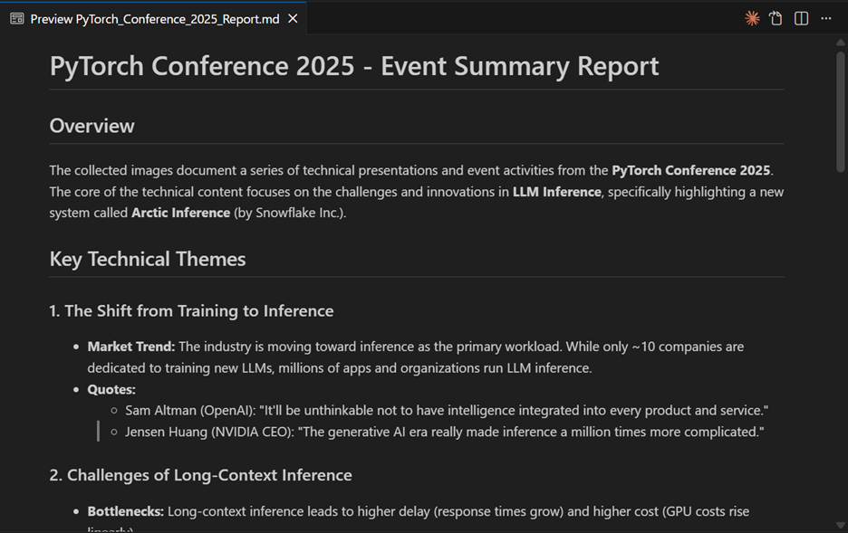
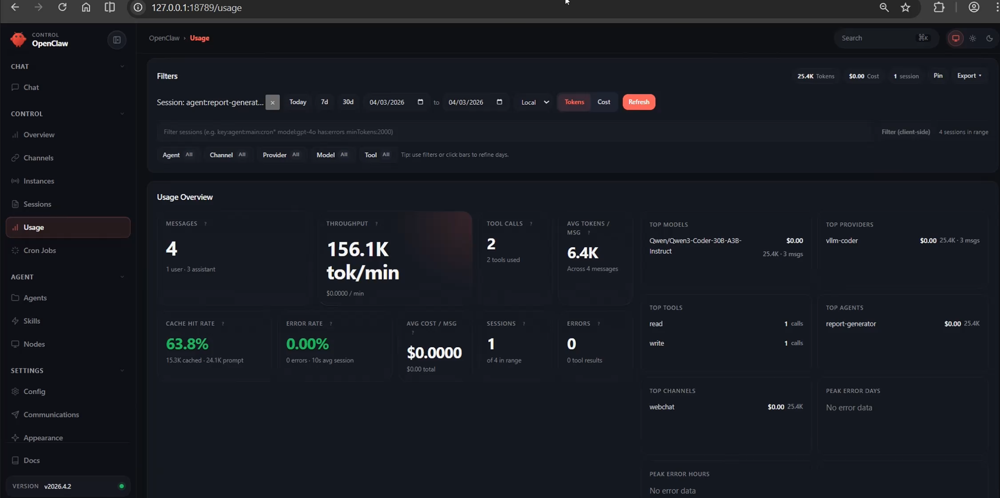

# OpenClaw Lens-to-Log:
#### Powered by Gemma 4 😎
### 📸 Transform Conference Photo Galleries into Expert Trip Reports

Ever attend a technical conference, take hundreds of photos of slides, and then let them rot in your camera roll? When it's time to write that "Trip Report" to share with your teammates, you're stuck scrolling through a disorganized mess of blurry images.

**OpenClaw🦞** is here solves this. This demo uses a multi-agent orchestration layer combined with state-of-the-art Vision Language Models (VLM) and Reasoning models to automatically transcribe your conference photos and synthesize them into a structured, professional technical report.

---

## 🤖 The Architecture

We want to have token freedom and be able to generate as many tokens as we want. That's why we tap the AMD GPU Developer Cloud instance, right? Now, we gave Gemma 4, the most dense 31B model and were impressed by it, being able to also fit in just one MI300X GPU with 192GB of VRAM. We want you to also experience that! 

Our OpenClaw demo uses one vLLM serving of Gemma-4 and a triple-agent approach:

* **Model**: The Brain and Eyes in our project: `Gemma-4-31B-it`, a multimodal model powerhouse supports text, images, and audio inputs and is optimized for advanced reasoning and agentic workflows 
* **The Agents:**
    1.  **Orchestrator Agent:** The conductor. It manages the workflow and delegates tasks.
    2.  **Transcriber Agent:** Processes individual images and extracts technical content.
    3.  **Report Generator Agent:** Aggregates transcriptions into a cohesive document.

---

## 🚀 Setup & Replication

### Step 1: Get hold of your AMD Developer Cloud GPU instance

We will keep this readme document digestible! We're in luck, we have two great blogs on walking you step by step with securing your AMD GPU Developer Cloud instance. Consult: 
1. [Introducing the AMD Developer Cloud](https://www.amd.com/en/blogs/2025/introducing-the-amd-developer-cloud.html)
2.  [Getting Started on the AMD Developer Cloud](https://www.amd.com/de/developer/resources/technical-articles/2025/how-to-get-started-on-the-amd-developer-cloud-.html)

Once you have your AMD GPU Developer Cloud instance, let's proceed with step 2.

### Step 2: Serve the powerful Gemma4-31B model with vLLM

Gemma 4 just got released recently and fresh out of the oven, it has impressed us. We want to impress you too. So will show you how to use this great model with OpenClaw! 

`ssh` into your AMD GPU Cloud instance from Step 1 and execute the following commands. Be default you will log in as root, so you should be able to run docker commands. 

`docker pull vllm/vllm-openai-rocm:latest`.

Here's a convenient command blob to get you running right from crawling stage. 

```bash
sudo docker run -d -it \
  --name vision_demo \
  --ipc=host \
  --network=host \
  --privileged \
  --device=/dev/kfd \
  --device=/dev/dri \
  -v /$USER/.openclaw/workspace:/workspace \
  -e HF_TOKEN=${HF_TOKEN} \
  -e PYTORCH_ALLOC_CONF=expandable_segments:True \
  -e VLLM_ALLOW_LONG_MAX_MODEL_LEN=1 \
  -e GLOO_SOCKET_IFNAME=lo \
  -e NCCL_SOCKET_IFNAME=lo \
  --entrypoint /bin/bash \
  vllm/vllm-openai-rocm:latest \
  -c "pip install --upgrade transformers && \
      python3 -m vllm.entrypoints.openai.api_server \
        --model google/gemma-4-31B-it \
        --port 8001 \
        --trust-remote-code \
        --gpu-memory-utilization 0.8 \
        --max-model-len 65536 \
        --limit-mm-per-prompt '{\"image\": 55}' \
        --max-num-seqs 64 \
        --max-num-batched-tokens 65536 \
        --enable-auto-tool-choice \
        --tool-call-parser gemma4 \
        --reasoning-parser gemma4 \
        --host 0.0.0.0"
```

**Note:**  Change the workspace directory (see one of the `-v` arguments) accordingly, it should the path of .openclaw (eg., `/home/<username>/.openclaw/workspace`

You may wish to spend some time and study the above command blob. You'll see we named our docker container as `vision_demo` so, to check the logs, can execute: 
`docker logs -f vision_demo`. 
Likewise, to stop and delete the container, you can execute:
`docker stop vision_demo && docker rm -f vision_demo`

### Step 3: Install OpenClaw
Here's a conveninent one-liner to install OpenClaw. You will install OpenClaw outside your docker container, naturally :) 
`curl -fsSL https://openclaw.ai/install.sh | bash`

Now, this readme will skip installation details about OpenClaw. There's ample documentation on this already. However, one key aspect we need to do during the post-installation process (in OpenClaw jargon, it is called `onboarding`), we need to let OpenClaw know where to find our model.

Therefore, we will configure the following when we reach that step about choosing our LLM backend:
Model: `vLLM`
Model Name: `google/gemma-4-31B-it`
vLLM key: `local-vllm` 
vLLM Provider: `vllm`
vLLM Port: `http://localhost:8001/v1`
 
In case you are not a root user, make sure you own the `.openclaw` directory: `sudo chown -R $USER:$USER ~/.openclaw`

#### Step 3.1 Further OpenClaw configurations
The commands below initializes the OpenClaw environment by setting up local authentication, defining vLLM as the primary provider for our pwoerful **Gemma-4 31B** vision model, and configuring tool execution permissions. It establishes the backend connection to our local model server and ensures the necessary directory structure exists. 
```bash
openclaw config set gateway.auth.token "claw123"  
openclaw config set gateway.mode "local"  
openclaw config set agents.defaults.model.primary "vllm/google/gemma-4-31B-it" 
openclaw config set agents.defaults.imageModel.primary "vllm/google/gemma-4-31B-it" 
openclaw config set models.providers.vllm '{"baseUrl": "http://localhost:8001/v1","apiKey": "local-vllm","api": "openai-completions","models": [{"id": "google/gemma-4-31B-it","name": "Gemma-4-Vision","input": ["text", "image"],"compat": {"supportsUsageInStreaming": true}}]}' 
openclaw config set tools.allow '["group:fs", "exec", "sessions_spawn", "subagents"]'   
openclaw config set tools.exec.ask "off"  
openclaw config set tools.exec.security "full" 
mkdir -p ~/.openclaw 
```
While you should generally be careful giving too much pwoer to OpenClaw, here, we are actually configuring OpenClaw in a way, saying "Don't ask for permission before running commands or touching files, but keep the full security restrictions active." This will allow `exec` and `fs` to work, as we will be opening images, and writing reports to disk. 

```bash
cat <<EOF > ~/.openclaw/exec-approvals.json 
{ 
  "security": "full", 
  "ask": "off", 
  "askFallback": "full", 
  "groups": { 
    "fs": { 
      "security": "full", 
      "ask": "off" 
    }, 
    "exec": { 
      "security": "full", 
      "ask": "off" 
    } 
  } 
} 
EOF 
```
We then start the OpenClaw Gateway service:
`systemctl --user start openclaw-gateway.service`

In OpenClaw’s "Local-First" architecture, the gateway doesn't trust new connections by default. When a new device tries to connect - for example, if you open the web dashboard or try to link the OpenClaw mobile app, it generates a unique Request ID.

Check if you have any devices in the `Pending List` section. If yes, you can simply run this shortcut command `openclaw devices approve --latest` to add the latest device, especially if you have only one device in the Pending List. 


### Step 4: Prepare the Workspace
Place your gazillion conference photos you took - yes, the ones you never intended to watch again - in a directory within your workspace directory. Your workspace directory may most likely be within the `/home/<username>.openclaw/` folder. So, don't worry, even if you won't consult the photos again, OpenClaw will do that for you :) . 

In our example, we are goign to write a Trip Report from last year's PyTorch Conference Day. We create a folder called `Day` for our pictures. 
```bash
mkdir -p <openclaw_path>/workspace/Day/
cp ~/sample_images/*.jpg <openclaw_path>/workspace/Day/
```


### Step 5: Configure OpenClaw
Update the configuration files and agent instructions to enable the multi-agent delegation.

Replace `config.json` and `openclaw.json` in `~/.openclaw/`. Use the ones shipped in this Github repository. 

**Highly Advisable** Read the `AGENTS.md` for each of the three agents in our demo : `orchestrator`, `transcriber`, and `report-generator`. This will give you an understanding of how the OpenClaw agents behave. There are some edits to do too, for example in the `AGENTS.md`, you will need to adapt the `<openclaw_path>`. 

### Step 6: Final Execution - Launch the Terminal UI (TUI) 
Since we made some modifications to the agents' guts and brains, we restart the gateway and launch the Terminal User Interface (TUI).

```bash
systemctl --user restart openclaw-gateway
OPENCLAW_AUTO_APPROVE=true openclaw tui --token "claw123"
```

#### 📝 Running the Demo
With our Agents properly configured, our OpenClaw TUI is ready to go to take an ask to process our Conference pictures and write a report. Let's give it a try with the sample text below. OpenClaw is now smart enough to engage the right expert agents to do the work. 

For example the `transcribe` agent will process the images, extract text from the images and export to intermediate files. The data is then channeled to the `report-generator` agent who will do the final report writing work - just by magic. Now, you can give fine-grained instructions to the `report-generator` agent on how you want your report. Let's say you are targetting Executives who you not have time to read verbose detailed reports, then you could adapt the agent accordingly to be brief, and write in bullet-point format. What you can do here is limitless :) 

Here's an example promt to get you going:
`Can you transcribe all the images in /home/jejohnma/.openclaw/workspace/Day/ . And then generate an overall report summary by combining and correlating all the info collected from all the images. Save the report summary in the current directory and share me the path`

An example output from OpenClaw will look as below:


Can you believe it? Just a simple sentence, simple command, and you have a small army of agents that get to work, to view these images you wouldn't ever watch, understand them, and write you a summary (aka the Trip Report) for you? 

Here's a sample of what you can expect:



### The Useful OpenClaw Dashboard
The OpenClaw Dashboard is a local web-based "mission control" that offers a visual alternative to the standard terminal interface. It features real-time thought-tracing to monitor agent logic, a graphical skill manager for ClawHub integrations, and detailed resource monitoring for performance tracking. Accessed via openclaw dashboard at `localhost:18789`, it is the primary tool for debugging complex agent loops and inspecting interaction logs without manually sifting through raw JSON data.

There you can track your tokens consumption and usage which is pretty useful. Especially, if you are using local models in the AMD Developer Cloud, you could compare with the potential costs, if you were to use APIs from intelligence providers. 

Here's what you can expect:


### 🔧 Troubleshooting & Maintenance
If you encounter issues or change configurations, use these commands to clean the environment:

#### Resetting the Environment:

```bash
# Stop lingering processes
pkill -f openclaw 

# Clear session data and locks
rm -rf ~/.openclaw/agents/*/sessions/*
rm -f ~/.openclaw/gateway.lock

# Global reset
openclaw reset --scope config+creds+sessions --yes

# Restart Gateway
systemctl --user stop openclaw-gateway.service  
sudo fuser -k 18789/tcp
systemctl --user restart openclaw-gateway
```

## 📅 The final take on this OpenClaw demo

When processing large datasets (e.g., a directory of 50+ images) for automated reporting, there are traditionally two main approaches:
1.	**Manual Processing**: Human review and manual data entry, which is non-scalable and prone to error.
2.	**Custom Scripting**: Developing dedicated Python scripts to interface with model APIs and handle directory I/O - a process that requires significant development overhead and maintenance.

#### The OpenClaw Advantage
OpenClaw introduces a third, more efficient paradigm: Natural Language Orchestration. Instead of writing boilerplate code to link directories and manage model calls, we provide a high-level narrative of the required task.

